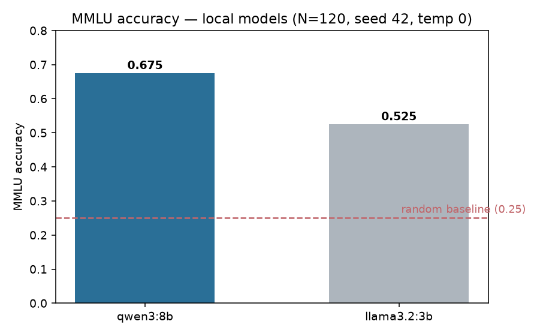
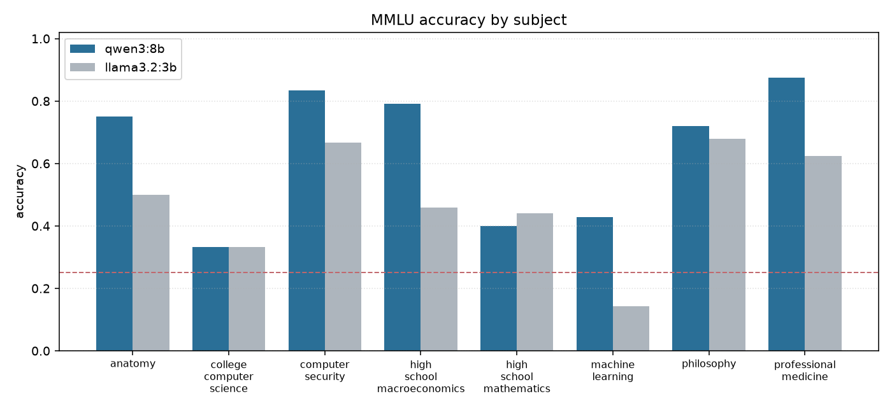

# genai-eval-framework — a pluggable LLM evaluation harness


[](https://github.com/ejazfahil/genai-eval-framework/actions/workflows/ci.yml)


A small, provider-agnostic framework for benchmarking large language models
through a common adapter interface, with parallel evaluation and on-disk response
caching so runs are fast and reproducible.

> **Status: runs end-to-end.** Adapters, the base classes, the parallel MMLU
> evaluator, and the content-addressed cache are implemented and tested; the harness
> produces **real MMLU numbers** on local models (committed under `results/`).
>
> **TL;DR (for reviewers).** A provider-agnostic LLM-eval harness — uniform model
> adapters (Ollama / Anthropic), a parallel MMLU evaluator, and a SHA-256 response
> cache for free, reproducible re-runs. Measured on 120 seeded MMLU questions
> (`temperature=0`), a local **qwen3:8b scores 0.675** vs **llama3.2:3b 0.525**
> (random = 0.25) — every number from a real run, no fabricated figures.
>
> | MMLU · N=120 · seed 42 · temp 0 | Accuracy |
> |---|:---:|
> | 🟢 qwen3:8b (local) | **0.675** |
> | ⚪ llama3.2:3b (local) | 0.525 |
> | random baseline | 0.25 |

---

## Overview & Aim

Comparing models fairly means running the *same* prompts through every model,
parsing answers consistently, and not paying (in latency or API cost) to
re-evaluate identical prompts. This framework factors those concerns apart:

- **Models** are hidden behind a uniform adapter (`complete(prompt, **kw) → {"text": ...}`),
  so a benchmark never knows whether it is talking to a hosted API or a local model.
- **Evaluators** own a dataset, an answer-parsing rule, and an aggregation, and
  run independently of which model they score.
- **Caching** sits underneath, keyed by `(prompt, model)`, so repeated runs hit
  disk instead of the network.

This separation is what lets the same MMLU harness score a frontier API model and
a locally-hosted open model with no code change.

---

## Architecture / How It Works

```
            ┌──────────────────────────────┐
 dataset ──▶│        MMLUEvaluator         │
            │  (ThreadPoolExecutor, 4 wkrs)│
            │  evaluate_single() per item  │
            └───────────────┬──────────────┘
                            │ model.complete(prompt, max_tokens)
                            ▼
            ┌──────────────────────────────┐
            │     Model adapter (uniform)  │
            │  AnthropicAdapter | Ollama   │
            └───────────────┬──────────────┘
                            │ (prompt, model) key
                            ▼
            ┌──────────────────────────────┐
            │  EvalCache  (sha256 → .json) │
            └──────────────────────────────┘
```

### Parallel evaluator

[`MMLUEvaluator`](src/evaluators/mmlu.py) loads a multiple-choice dataset, fans
the items out across a `ThreadPoolExecutor` (4 workers), and for each item:

1. prompts the model for a single-token answer,
2. extracts the first `A`/`B`/`C`/`D` token via regex,
3. records a boolean `correct`.

Aggregation reduces to `accuracy = mean(correct)`. Thread-level parallelism is the
right tool here because each evaluation is I/O-bound on a model call.

### Model adapters

A concrete adapter implements `_call_api(prompt, **kw)` and returns `{"text": ...}`:

- [`AnthropicAdapter`](src/models/anthropic_adapter.py) — wraps the official
  `anthropic` SDK (`messages.create`), reading `ANTHROPIC_API_KEY` from the
  environment and defaulting to `claude-3-haiku-20240307`.
- [`OllamaAdapter`](src/models/ollama_adapter.py) — talks to a local Ollama
  server over `POST /api/generate` (stdlib `urllib`, no extra dependency),
  defaulting to `llama3:8b`.

### Response cache

[`EvalCache`](src/utils/cache.py) hashes `(prompt, model)` with SHA-256 and stores
each response as a JSON file under `.eval_cache/`. A cache miss returns `None`; a
hit returns the stored payload — making re-runs deterministic and free.

---

## Tech Stack & Tools

- **Python 3.11+** with `concurrent.futures` for parallelism
- **anthropic** — official SDK for the Claude adapter
- **Ollama** HTTP API — local open-model serving (via stdlib `urllib`)
- `hashlib` / `json` / `os` — dependency-free disk cache
- **pytest** — unit tests

---

## Project Structure

```
genai-eval-framework/
├── run_eval.py                  # CLI: run MMLU over models → results/mmlu_leaderboard.json
├── requirements.txt             # datasets + pytest
├── src/
│   ├── base_evaluator.py        # BaseEvaluator: dataset + parse + aggregate contract
│   ├── evaluators/
│   │   └── mmlu.py               # MMLUEvaluator: real cais/mmlu, parallel, per-subject
│   ├── models/
│   │   ├── base_adapter.py       # BaseModelAdapter: uniform complete() + cache glue
│   │   ├── anthropic_adapter.py  # Claude via the anthropic SDK
│   │   └── ollama_adapter.py     # local models via the Ollama HTTP API
│   └── utils/
│       └── cache.py              # EvalCache: sha256((prompt, model)) → JSON
├── tests/
│   └── test_utils.py            # cache hit/miss behavior (tempdir-isolated)
├── results/                     # committed leaderboard JSON + plots (measured)
└── docs/
    └── BENCHMARKS.md            # measured MMLU results + reproduce command
```

---

## Key Features

- **Uniform adapter contract** — benchmarks are model-agnostic.
- **Hosted + local out of the box** — Claude (API) and Ollama (local) adapters.
- **Parallel evaluation** — `ThreadPoolExecutor` over I/O-bound model calls.
- **Deterministic, free re-runs** — content-addressed JSON cache keyed by
  `(prompt, model)`.
- **Single-token MC parsing** — robust `A/B/C/D` extraction for MMLU-style tasks.

---

## Results

Real MMLU results from this harness on local models (Ollama, free), committed under
`results/`. **120 questions, seed 42, `temperature=0`**, sampled across 8 MMLU subjects.

| Model | MMLU accuracy | n | Provider |
|-------|:-------------:|:-:|----------|
| **qwen3:8b** | **0.675** | 120 | Ollama (local) |
| llama3.2:3b | 0.525 | 120 | Ollama (local) |

Random baseline = 0.25; both models clear it comfortably, and the 8B model shows a clear edge over the 3B one.





Per-subject the gap is uneven — both models are strong on `computer_security` and `professional_medicine` and weak on `machine_learning` / `high_school_mathematics` — exactly the signal a per-subject harness exists to surface. Full numbers in [`results/mmlu_leaderboard.json`](results/mmlu_leaderboard.json); reproduce command in [`docs/BENCHMARKS.md`](docs/BENCHMARKS.md).

> **Integrity note:** an earlier `docs/BENCHMARKS.md` listed illustrative frontier-model figures that were **not** produced by this code. They have been removed — only measured numbers are reported here.

---

## Getting Started

```bash
pip install -r requirements.txt
python -m pytest tests/ -q                 # unit tests

# Free & local — needs Ollama running (`ollama serve`) with the models pulled:
python run_eval.py --models llama3.2:3b,qwen3:8b --n 120 --seed 42

# Hosted (needs ANTHROPIC_API_KEY):
python run_eval.py --provider anthropic --models claude-3-haiku-20240307 --n 120
```

Or from Python:

```python
from src.models.ollama_adapter import OllamaAdapter
from src.evaluators.mmlu import MMLUEvaluator

model = OllamaAdapter(model="llama3.2:3b")
print(MMLUEvaluator(model).run(max_samples=50, seed=42))  # {"accuracy": ..., "by_subject": {...}}
```

---

## Challenges

- **Provider heterogeneity** — hosted SDKs and local HTTP servers expose very
  different shapes; the adapter contract normalizes them to `{"text": ...}`.
- **Answer extraction** — free-form generations must be parsed to a single choice
  without over-counting; a strict first-`[ABCD]` regex keeps this honest.
- **Cost & reproducibility** — the content-addressed cache removes both repeated
  spend and run-to-run nondeterminism for identical prompts.

## Roadmap

- ✅ `BaseEvaluator` / `BaseModelAdapter` base classes with the `complete()` + cache glue.
- ✅ Real MMLU dataset (`cais/mmlu`) wired behind `load_dataset()` with per-subject scoring, plus a `run_eval.py` CLI and committed results.
- Add HumanEval / GSM8K evaluators reusing the same adapter contract.
- Integrate the cache into the adapter call path automatically.
- Temperature/seed pinning and per-run metadata for fully reproducible reports.

## Conclusion

`genai-eval-framework` is a clean, provider-agnostic LLM evaluation stack — uniform
adapters, parallel scoring, and a content-addressed cache — now **running end-to-end**
with real MMLU numbers (qwen3:8b **0.675** vs llama3.2:3b **0.525** on a seeded
120-question slice, `temperature=0`).

**What this project demonstrates (for reviewers):** the moving parts of a real eval
platform — a uniform adapter contract (local Ollama + hosted Claude), a parallel
evaluator with strict answer parsing (including reasoning-model handling via
`think=false`), a SHA-256 response cache for free/deterministic re-runs, and honest
reporting: measured numbers committed, small samples flagged, and fabricated
reference figures removed. Next up: HumanEval / GSM8K evaluators on the same contract.
